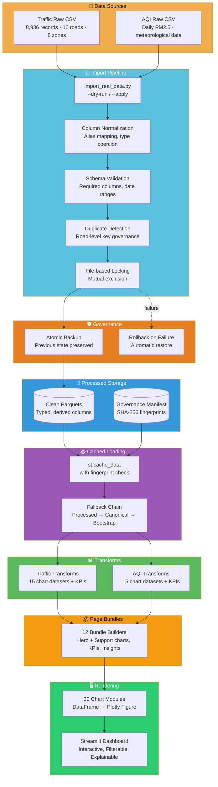
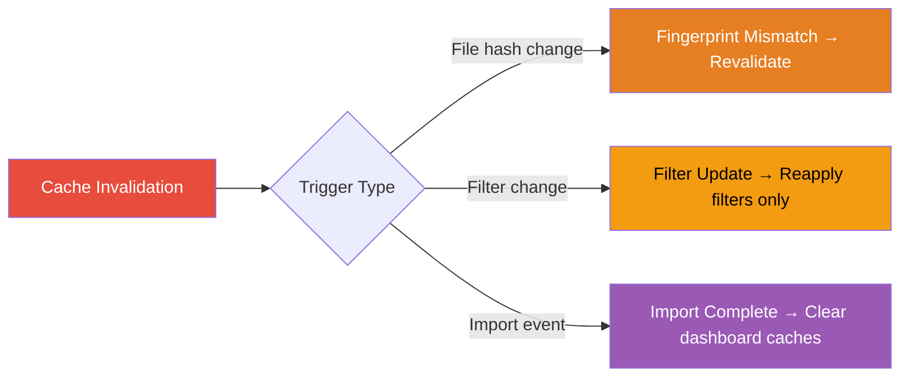

# Data Pipeline

How raw CSVs become interactive visualisations, with every data handoff validated.

## Stage 1: Import

Raw CSVs are normalized, validated, and deduplicated before writing canonical parquet files. The CLI supports `--dry-run` for safe preview and `--apply` for execution. File-based locking prevents concurrent imports. Atomic backup ensures failed imports never corrupt working data.

## Stage 2: Loading

`data_layer/loaders.py` resolves data through a priority chain: processed parquet → canonical raw parquet → synthetic bootstrap. Each load is fingerprinted against the governance manifest. Fingerprint mismatches trigger cache invalidation.

## Stage 3: Transforms

Transform functions compute chart-ready datasets from clean parquets. Each function produces exactly the DataFrame shape its chart expects. No chart function performs aggregation — all computation happens here.

## Stage 4: Bundles

Page bundle builders assemble transforms into structured dictionaries containing hero chart, support charts, KPI values, insight text, and navigation metadata. Each of the 12 pages has its own builder.

## Stage 5: Rendering

Chart modules receive clean DataFrames and return Plotly `Figure` objects. They contain zero business logic — only visualisation code. Chart containers handle titles, loading skeletons, fullscreen, and captions.

## Cache Invalidation

The `performance.py` module tracks a dependency graph mapping each chart to its transforms and caches. When a filter changes, only affected caches are invalidated — not the entire data layer.
