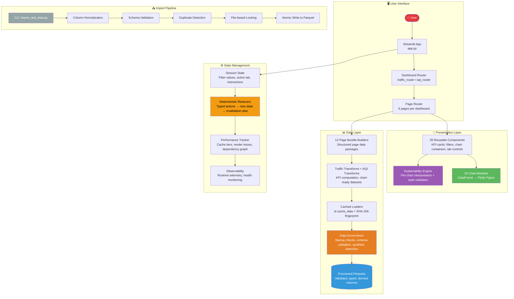

# System Architecture

How every module in the Bangalore Urban Intelligence Platform connects and why each boundary exists.

## Module Responsibilities

| Module | What It Does |
|--------|-------------|
| **app.py** | Entry point. Runs startup governance checks, initializes state, switches between dashboards. |
| **config/** | Color tokens, data schema, chart sizing, page definitions. |
| **dashboards/** | Dashboard routing and 30 chart modules (Traffic T-01–T-15, AQI A-01–A-15). |
| **components/** | 28 reusable UI building blocks shared across both dashboards. |
| **data_layer/** | Data loading, transforms, page bundle assembly, import pipeline with governance. |
| **explainability/** | Static metadata for every chart: interpretation, glossary, misinterpretation warnings. |
| **filters/** | Session state, deterministic reducers, chart dependency tracking, interaction management. |
| **services/** | Performance tracking, cache management, export, drilldown detail content builders. |
| **utils/** | CSS injection, formatting, Plotly theming, data validation, accessibility auditing. |
| **tests/** | 48 test modules covering governance, validators, explainability, and chart rendering. |

## Dependency Rules

Every dependency points inward toward the data layer:

- **Charts** depend on Bundles, never on raw data
- **Components** are read-only UI building blocks
- **Filters** modify session state, never chart rendering
- **Governance** validates at every boundary (import, load, runtime)
