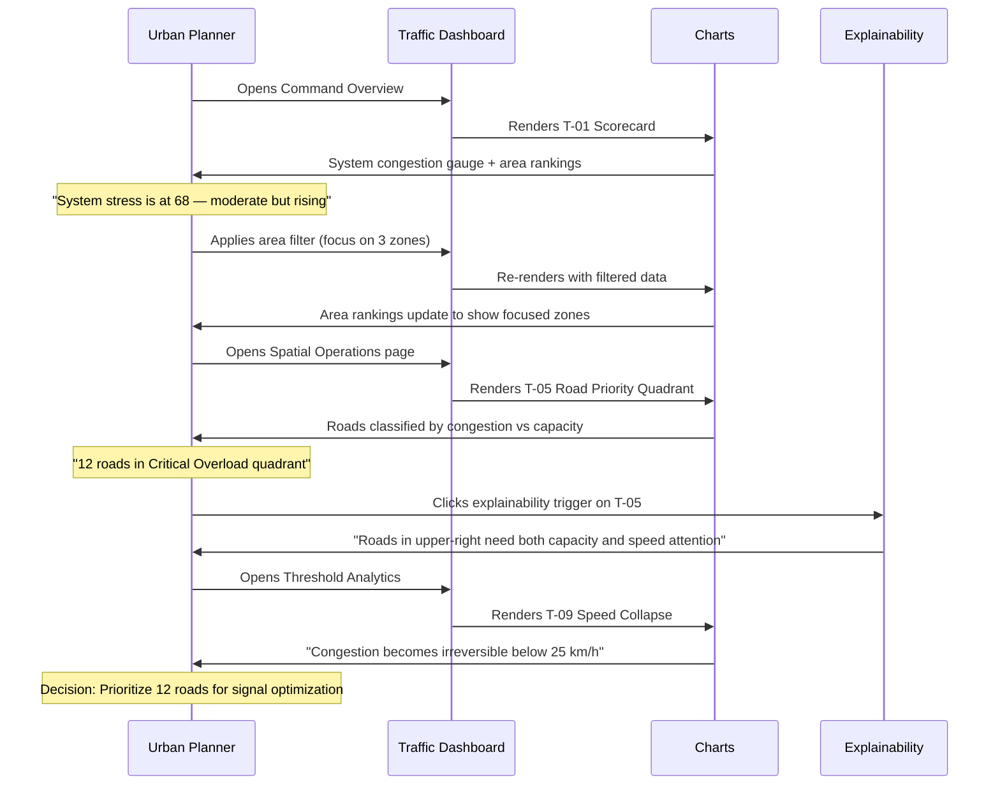
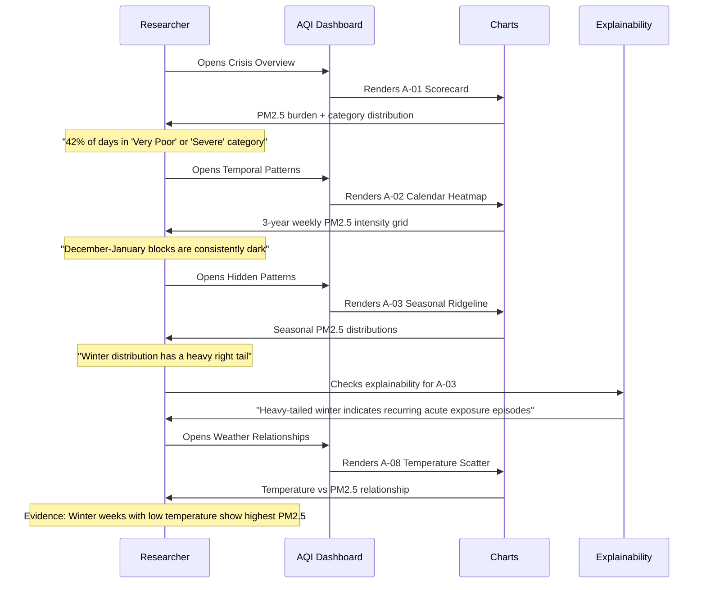
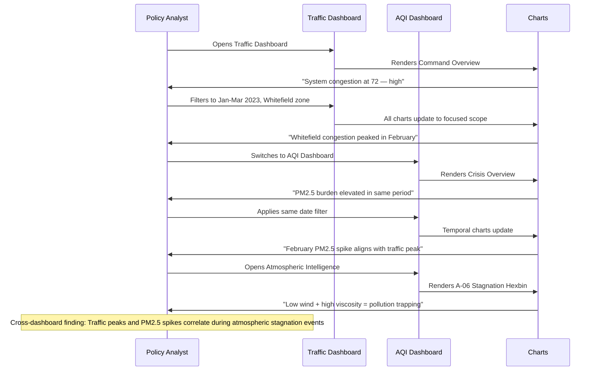
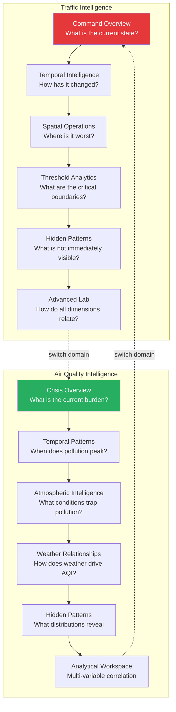
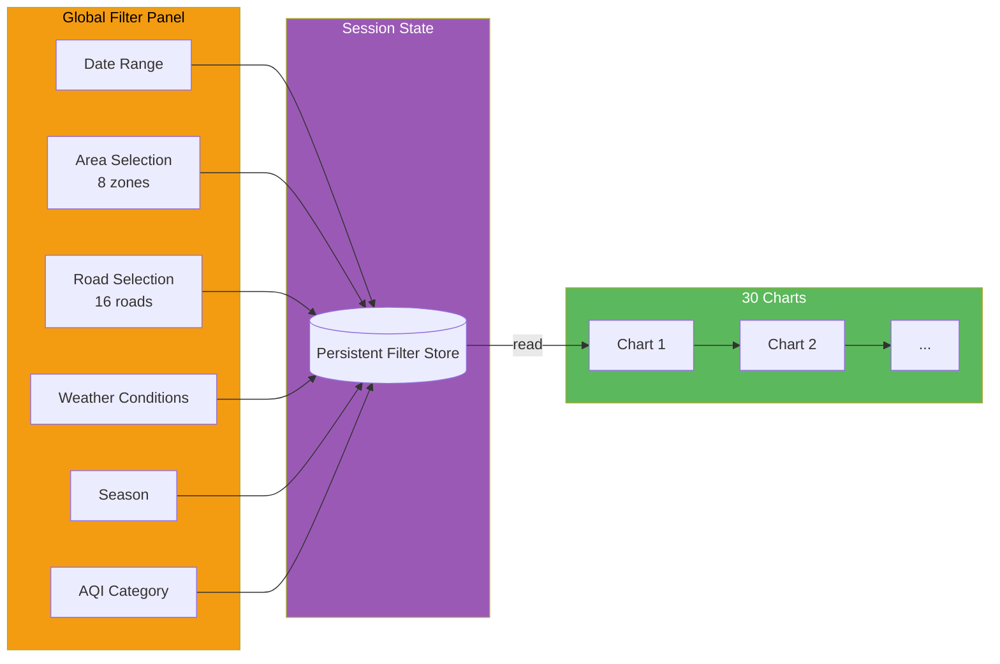

# User Journey

How three personas navigate the platform to answer real analytical questions and reach evidence-based decisions.

## Journey Overview

---

## Persona 1: Urban Planner

**Question:** *"Which areas need immediate infrastructure investment?"*

**Key charts used:** T-01 (Scorecard), T-05 (Quadrant), T-09 (Speed Threshold)
**Decision enabled:** Infrastructure investment prioritization across 8 Bangalore zones

---

## Persona 2: Public Health Researcher

**Question:** *"How bad was air quality this winter, and which areas were most exposed?"*

**Key charts used:** A-01 (Scorecard), A-02 (Calendar), A-03 (Ridgeline), A-08 (Temperature)
**Decision enabled:** Seasonal health risk assessment and preparedness planning

---

## Persona 3: Policy Analyst

**Question:** *"How do traffic patterns and air quality relate in specific neighborhoods?"*

**Key charts used:** T-01 (Traffic Overview), A-01 (AQI Overview), A-06 (Stagnation)
**Decision enabled:** Evidence base for integrated transport-environment policy

---

## Navigation Architecture

Each page is organized around an analytical question. The progression moves from awareness to mastery:

---

## Interaction Model

### Global Filters
Filters persist across all charts within a dashboard. Changing the date range, area selection, or weather filter recomputes every chart on the current page.

### Investigation Overlays
Clicking a chart element creates a temporary overlay that highlights related data across other charts. Overlays are cleared with "Clear Focus" — they never modify the underlying filter state.

### Explainability Triggers
Every chart has a "?" trigger that opens structured interpretation: what the chart shows, what patterns matter, what users commonly misunderstand, and what to investigate next.

### Advanced Lab Mode
The Lab page requires explicit entry through a gate component. Lab controls expose analytical parameters (area selection, overlay count, dimension toggles) that production pages hide to reduce cognitive load.

---

## Filter Architecture

Filters are application-wide state, not per-chart. When you filter to "Whitefield zone, January 2023," every chart on the page shows the same subset of data. This ensures consistent scope across all visualisations.
